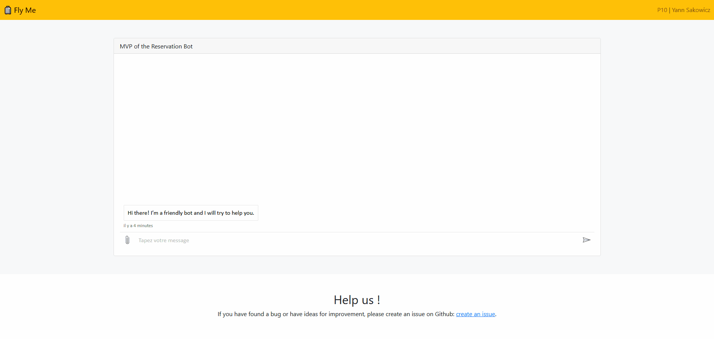
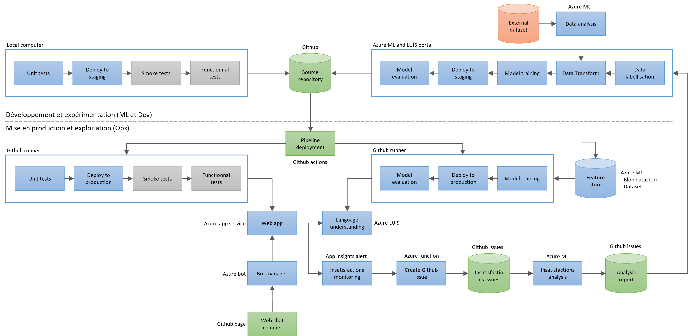

# Introduction

Ce projet a pour but la réalisation d'un MVP d'un chatbot pour aider les utilisateurs à choisir une offre de voyage.

La version actuelle est en anglais. Elle permet de détecter les éléments suivants :
- Ville de départ.
- Ville de destination.
- Date aller souhaitée du vol.
- Date retour souhaitée du vol.
- Budget maximum pour le prix total des billets.

Si un des éléments est manquant, le chatbot va poser des questions pertinentes à l’utilisateur pour comprendre complètement sa demande. Lorsque le chatbot pense avoir compris tous les éléments de la demande de l’utilisateur, il reformule la demande de l’utilisateur et lui demande de valider sa compréhension.

Nous avons aussi mis en place une architecture MLOps qui va nous permettre d'itérer rapidement sur le MVP.

# Live demo

On pourra tester le chatbot sur la Github Page de ce projet. Pour y accéder, cliquer sur le lien suivant : [live demo](https://sako74.github.io/p10/).

<div align="center">
  
</div>
<p align="center">Démonstration du MVP</p>

# Architecture du projet

Nous avons aussi mis en place une architecture MLOps qui va nous permettre d'itérer rapidement sur le MVP.


<p align="center">Architecture MLOps</p>

# Création du l'infrastructure

Pour utiliser ce projet, il faut commencer par créer plusieurs ressources sur Microsoft Azure et sur Github.

## Création de la ressource Azure Machine Learning

Suivez les instructions de ce tutoriel : [Démarrage rapide : créer les ressources d’espace de travail nécessaires pour commencer à utiliser Azure Machine Learning](https://docs.microsoft.com/fr-fr/azure/machine-learning/quickstart-create-resources).

Cloner ce projet sur une instance de calcul.

Ouvrir une invite de commande et aller dans le dossier du projet.

Taper les lignes suivantes afin d'installer l'environnement conda nécessaire à l'exécution des notebooks :
```
conda env create --name p10 --file P10_01_notebooks/conda_env.yml
conda activate p10
python -m ipykernel install --user --name=p10
```

## Ajout du secret `AZURE_WORKSPACE`

Ajouter le secret `AZURE_WORKSPACE` dans votre repository Github avec la valeur suivante :
```
{
  "resourceGroup": "<nom du groupe de ressources de azure ml>",
  "workspaceName": "<nom du workspace de azure ml>"
}
```

## Ajout du secret `AZURE_CREDENTIALS`

Il va falloir donner l'autorisation à Github d'accéder aux resources de Microsoft Azure. Pour cela, nous allons créer une Service Pincipal sur Azure.

Ouvrir une invite de commande et taper la commande suivante :
```
az ad sp create-for-rbac --name "p10-sp" --role contributor --sdk-auth
```

Ajouter le secret `AZURE_CREDENTIALS` dans votre repository Github avec la valeur renvoyée par la commande précédente.

## Création des ressources LUIS

Ouvrir une invite de commande et aller dans le dossier du projet.

Taper les commandes suivantes afin de créer les ressources qui vont permettre de créer les ressources LUIS :
```
cd P10_02_luis/
./luis_create.sh
```

## Ajout du secret `LUIS_ENV`

Ajouter le secret `LUIS_ENV` dans votre repository Github avec la valeur renvoyée à la fin de la commande précédente.

## Création des ressources du chatbot

Ouvrir une invite de commande et aller dans le dossier du projet.

Taper les commandes suivantes afin de créer les ressources qui vont permettre de créer les ressources du chatbot :
```
cd P10_03_chatbot/
./chatbot_create.sh
```

## Ajout du secret `WEBAPP_ENV`

Ajouter le secret `WEBAPP_ENV` dans votre repository Github avec la valeur renvoyée à la fin de la commande précédente.

## Mise à jour la Github Page

Dans Azure, aller sur la ressource `p10-chatbot-bot` précédemment créée. Aller dans la section `Canaux/Web Chat` et copier une des clés secrètes.

Editer le fichier `index.html` de la banche `gh-pages`. Rechercher la balise `iframe` et remplacer la clé secrète par la nouvelle. Commiter le changement.

Attention, il y a plusieurs façons d'utiliser le canal `Web Chat`. Celle utilisée ici n'est pas recommandée pour la mise en production d'un produit final ([en savoir plus](https://docs.microsoft.com/en-us/azure/bot-service/bot-service-channel-connect-webchat?view=azure-bot-service-4.0)).

## Création des ressources de l'azure function

Ouvrir une invite de commande et aller dans le dossier du projet.

Taper les commandes suivantes afin de créer les ressources qui vont permettre de créer les ressources de l'azure function :
```
cd P10_04_function/
./function_create.sh
```

## Ajout du secret `AZURE_FUNCTION_PUBLISH_PROFILE`

Ajouter le secret `AZURE_FUNCTION_PUBLISH_PROFILE` dans votre repository Github avec la valeur renvoyée à la fin de la commande précédente.

Ce secret est utilisé par la Github action [Azure/functions-action@v1](https://github.com/marketplace/actions/azure-functions-action) qui permet de déployer le code du dossier P10_04_function/create_github_issue.

## Ajout du secret `FUNCTION_ENV`

Créer un token d'accès personnel en suivant les instructions suivantes : [Creating a personal access token](https://docs.github.com/en/authentication/keeping-your-account-and-data-secure/creating-a-personal-access-token).

Ajouter le secret `FUNCTION_ENV` dans votre repository Github avec les valeurs suivantes :
```
GITHUB_TOKEN=<GITHUB_TOKEN>
GITHUB_REPO=Sako74/p10
```

Ce secret va permettre à l'azure function d'accéder au repository Github du projet et de créer automatiquement des issues.

## Création des ressources pour l'alerte de satisfaction

Ouvrir une invite de commande et aller dans le dossier du projet.

Taper les commandes suivantes afin de créer les ressources qui vont permettre de créer les ressources de l'alerte de satisfaction :
```
cd P10_05_alert/
./alert_create.sh
```

# Déployer le MVP

## Déployer le modèle LUIS

Exécuter le worklow suivant : [LUIS deploy](https://github.com/Sako74/p10/actions/workflows/luis_deploy.yml).

## Déployer le chatbot

Exécuter le worklow suivant : [Webapp deploy](https://github.com/Sako74/p10/actions/workflows/webapp_deploy.yml).

## Déployer l'azure function

Exécuter le worklow suivant : [Function deploy](https://github.com/Sako74/p10/actions/workflows/function_deploy.yml).

# Organisation du projet

Les projet est répartit en 5 dossiers.

# Dossier .github/workflows

Ce dossier contient la description des pipelines de déploiement continu.

## Dossier P10_01_notebooks

Ce dossier contient les notebooks du projet.

## Dossier P10_02_luis

Ce dossier contient tous les scripts permettant de :
- Créer les ressources LUIS sur Azure.
- Entrainer, déployer et évaluer un modèle LUIS.

## Dossier P10_03_chatbot

Ce dossier contient tous les scripts permettant de :
- Créer les ressources du chatbot sur Azure.
- Tester et déployer l'application web du chatbot.

## Dossier P10_04_function

Ce dossier contient tous les scripts permettant de :
- Créer les ressources de l'azure function sur Azure.
- Tester et déployer l'azure function qui va créer automatiquement des Github issues.

## Dossier P10_05_alert

Ce dossier contient tous les scripts permettant de :
- Créer les ressources et l'alerte des insatisfactions sur Azure.
